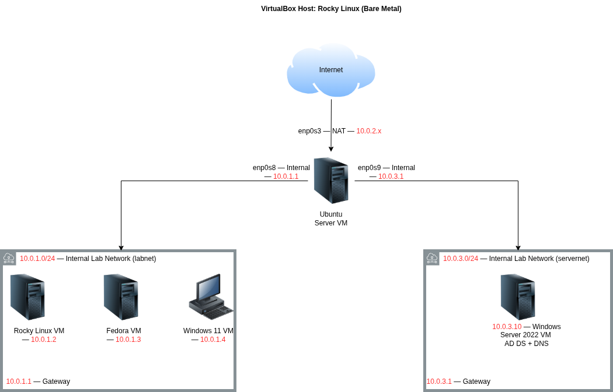

# Active Directory Domain Controller

Windows Server 2022 promoted to a Domain Controller 
with DNS, RDS Web Access portal, and LDAP integration. 
Part of a connected hybrid enterprise lab running on 
bare metal Rocky Linux.

## Network Topology

## Status: In Progress

Full README with build steps, real issues, and 
lessons learned coming when the project is complete.

Ubuntu gateway updated with 
third adapter (servernet 10.0.3.0/24), iptables 
inter-subnet rules configured, and tcpdump baseline 
verified. Next: deploying Windows Server 2022 VM.

## Lab Series

- [Project 1 — Linux Enterprise Gateway](https://github.com/mansour-wade/Linux-Enterprise-Gateway) — Complete
- Project 2 — Active Directory DC — In Progress
