# Active Directory Domain Controller

Windows Server 2022 Domain Controller deployed on an isolated server subnet, integrated with the Ubuntu gateway built in Project 1. It handles authentication, DNS resolution, and OU-based identity management for a multi-client hybrid lab running Rocky Linux, Fedora, and Windows 11.

---

## Table of Contents

- [What I Built](#what-i-built)
- [Tech Stack and Environment](#tech-stack-and-environment)
- [Project Files](#project-files)
- [Network Topology](#network-topology)
- [The Build](#the-build)
  - [1. Adding the Server Subnet](#1-adding-the-server-subnet)
  - [2. Stateful Inter-Subnet Routing](#2-stateful-inter-subnet-routing)
  - [3. Windows Server 2022 Installation](#3-windows-server-2022-installation)
  - [4. Static IP and Pre-Promotion Baseline](#4-static-ip-and-pre-promotion-baseline)
  - [5. Installing AD DS and Promoting DC01](#5-installing-ad-ds-and-promoting-dc01)
  - [6. OU Structure and Admin Account](#6-ou-structure-and-admin-account)
  - [7. ICMP DROP Rule](#7-icmp-drop-rule)
- [Troubleshooting and Real Issues](#troubleshooting-and-real-issues)
  - [Issue 1: VM Booted ISO Instead of Hard Drive](#issue-1-vm-booted-iso-instead-of-hard-drive)
  - [Issue 2: DC01 Not Responding to ICMP](#issue-2-dc01-not-responding-to-icmp)
  - [Issue 3: ip_forward Not Surviving Reboot](#issue-3-ip_forward-not-surviving-reboot)
  - [Issue 4: ICMP DROP Rule Blocking Reply Packets](#issue-4-icmp-drop-rule-blocking-reply-packets)
- [Security Decisions](#security-decisions)
- [Final Verification](#final-verification)
- [What I Learned](#what-i-learned)
- [Single Point of Failure Note](#single-point-of-failure-note)

---

## What I Built

I extended the Ubuntu gateway from Project 1 into a full domain environment. The gateway already had two interfaces. I added a third one, `enp0s9`, which creates a dedicated server subnet called `servernet` at `10.0.3.0/24`, isolated from the client subnet `labnet` at `10.0.1.0/24`. DC01 runs on servernet and never touches labnet directly. All traffic between the two subnets routes through the gateway under stateful iptables rules.

This isn't a tutorial follow-along. I hit real issues: a VM that kept booting back into the installer ISO, a Windows Defender firewall rule silently blocking all ICMP, ip_forward resetting to 0 on every reboot because cloud-init overrides sysctl.conf, and an iptables DROP rule that broke traffic in both directions because I left out stateful matching. Each one is documented below with the cause and the fix.

---

## Tech Stack and Environment

| Component | Specification |
| :--- | :--- |
| Host OS | Rocky Linux 9.7 (Blue Onyx) |
| Hypervisor | Oracle VirtualBox |
| Gateway OS | Ubuntu Server 24.10 (Oracular - EOL) |
| Domain Controller | Windows Server 2022 Datacenter Evaluation |
| AD Domain | lab.local |
| DNS | Integrated with AD DS on DC01 |
| Clients | Rocky Linux 9.5, Fedora 35, Windows 11 |
| Firewall/NAT | iptables v1.8.10 (nf_tables) |

---

## Project Files

The `configs/` folder contains the actual configuration files from this project. The README explains the decisions and the configs folder shows the work.

| File | Source Path | What It Shows |
| :--- | :--- | :--- |
| [50-cloud-init.yaml](configs/50-cloud-init.yaml) | `/etc/netplan/50-cloud-init.yaml` | enp0s9 added with static IP 10.0.3.1/24 for servernet isolation |
| [rules.v4](configs/rules.v4) | `/etc/iptables/rules.v4` | Full ruleset including client NAT, inter-subnet stateful rules, and ICMP DROP |
| [99-gateway-routing-fix.conf](configs/99-gateway-routing-fix.conf) | `/etc/sysctl.d/99-gateway-routing-fix.conf` | Persistent ip_forward fix that survives reboot and overrides cloud-init |
| [project2-baseline.pcap](configs/project2-baseline.pcap) | captured on enp0s8 | Baseline ICMP capture before DC deployment, open in Wireshark |

---

## Network Topology


---

## The Build

### 1. Adding the Server Subnet

The gateway already had two interfaces from Project 1. `enp0s3` faces the internet and `enp0s8` faces `labnet`. I added a third adapter in VirtualBox set to Internal Network named `servernet`, which appeared as `enp0s9` inside Ubuntu.

Before touching Netplan, I confirmed the interface was detected:

```bash
ip addr show enp0s9
```

The output showed the interface was present but DOWN with no IP assigned. I updated `/etc/netplan/50-cloud-init.yaml` to assign it a static `10.0.3.1/24` and applied it:

```bash
sudo netplan apply
```

`enp0s9` came up at `10.0.3.1/24`, which becomes the default gateway for everything on servernet, including DC01.

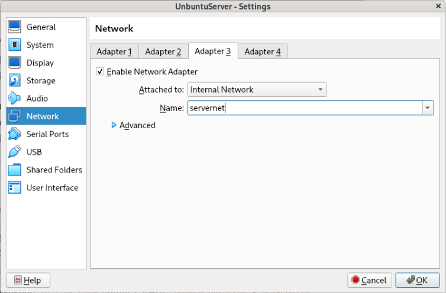
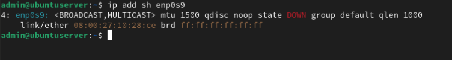
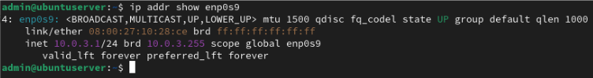

---

### 2. Stateful Inter-Subnet Routing

With two internal subnets, the gateway needs to route between them. The Project 1 iptables rules only handled `labnet` traffic, so I added two more rules to cover `servernet`:

```bash
# Forward from labnet to servernet — clients can reach DC01
sudo iptables -A FORWARD -i enp0s8 -o enp0s9 -j ACCEPT

# Stateful return — only replies to established connections allowed back
sudo iptables -A FORWARD -i enp0s9 -o enp0s8 -m state --state RELATED,ESTABLISHED -j ACCEPT
```

The second rule is what enforces the one-way initiation policy. Clients can open connections to DC01. DC01 cannot open new connections to clients because only reply packets from established sessions are allowed back through.

```bash
sudo netfilter-persistent save
```

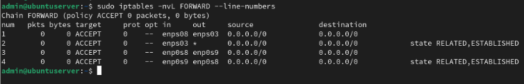

---

### 3. Windows Server 2022 Installation

I created a new VM in VirtualBox and attached the Windows Server 2022 evaluation ISO. Adapter 1 was set to Internal Network named `servernet` because it is the only network DC01 needs to see.

After installation, Server Manager opened to the dashboard on first login. At this point DC01 had no domain, no DNS role, and no static IP.

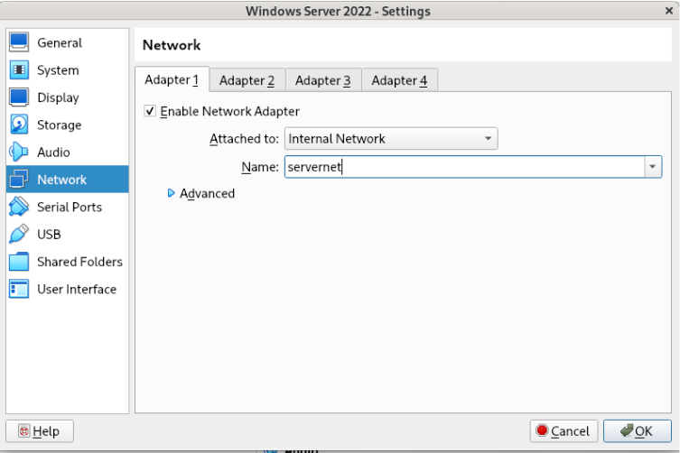
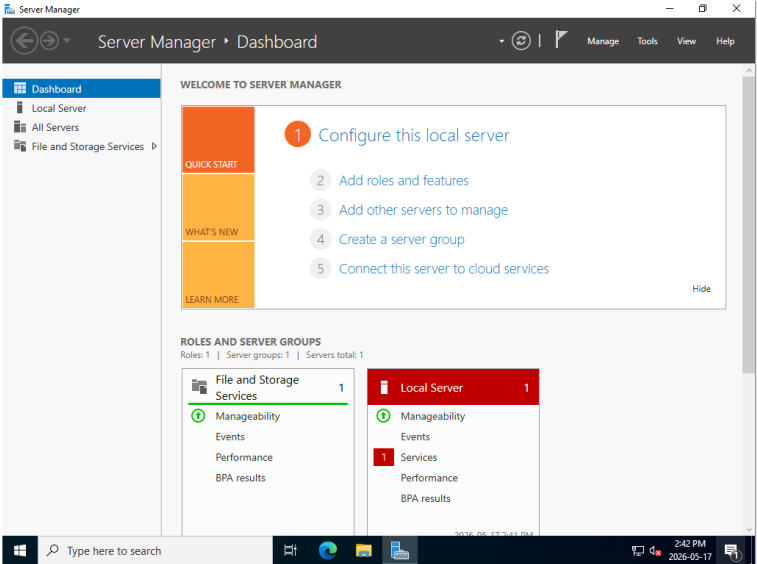

---

### 4. Static IP and Pre-Promotion Baseline

Before installing any roles, I assigned DC01 a static IP through the Windows network adapter settings:

```
IP address:       10.0.3.10
Subnet mask:      255.255.255.0
Default gateway:  10.0.3.1
DNS server:       10.0.3.10
```

The DNS server points to itself. Once AD DS is promoted and the DNS role is running, DC01 resolves its own domain. Setting this before promotion is not optional because the AD DS Configuration Wizard requires a static IP and will fail if it detects DHCP.

I renamed the server to DC01 via System Properties and rebooted.

I also captured a tcpdump baseline on `enp0s8` before DC01 was promoted. It captured 20 packets with 0 dropped, giving a clean reference point for traffic before the DC was introduced to the network.

```bash
sudo tcpdump -i enp0s8 -n icmp -w project2-baseline.pcap
```

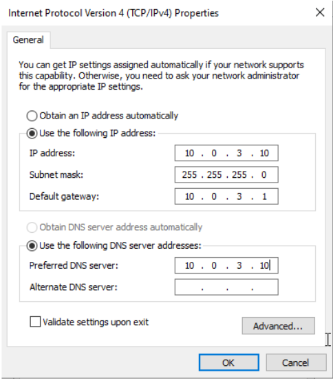
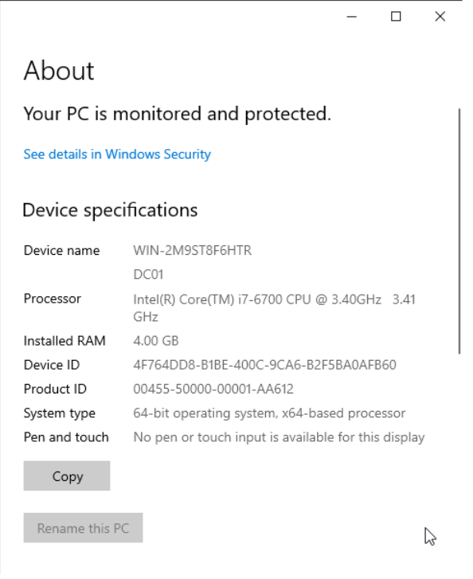
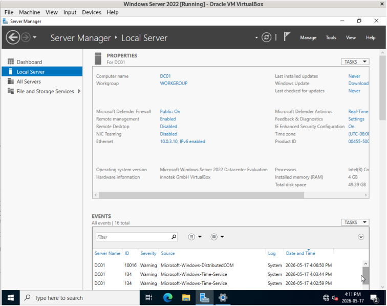
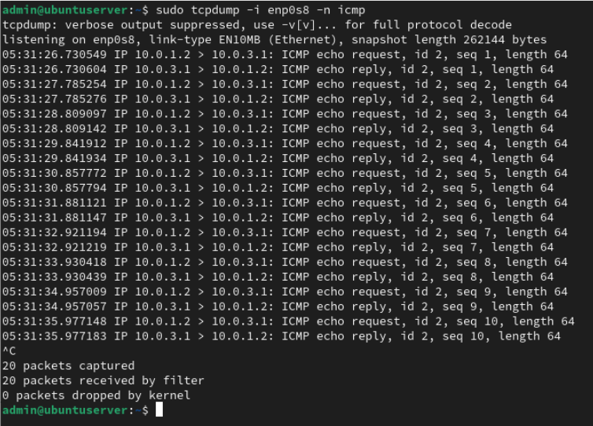
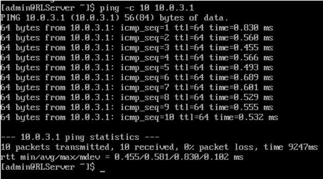
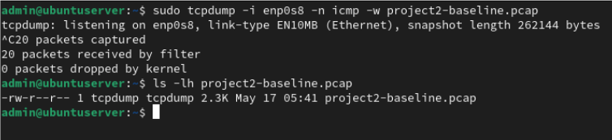

---

### 5. Installing AD DS and Promoting DC01

I installed the AD DS role through Server Manager by going to Add Roles and Features and selecting Active Directory Domain Services. Group Policy Management and the AD DS administration tools were pulled in automatically as dependencies.

After the role installed, the yellow flag appeared in Server Manager prompting me to promote the server to a domain controller. I ran the AD DS Configuration Wizard with these settings:

- Deployment operation: Add a new forest
- Root domain name: `lab.local`
- Forest and domain functional level: Windows Server 2016
- DNS server: enabled
- Global Catalog: enabled
- NetBIOS domain name: `LAB`
- DSRM password: set

The prerequisites check passed with two warnings. One was about cryptography algorithms compatible with Windows NT 4.0, which is expected in a new forest. The other was about DNS delegation, which is expected because there is no parent DNS zone. Neither one blocks installation.

DC01 rebooted automatically after promotion. Server Manager confirmed the domain on next login showing Computer name DC01 and Domain lab.local.

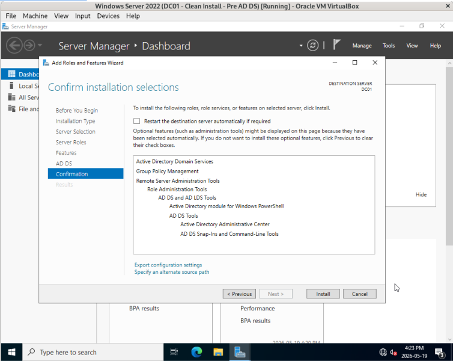
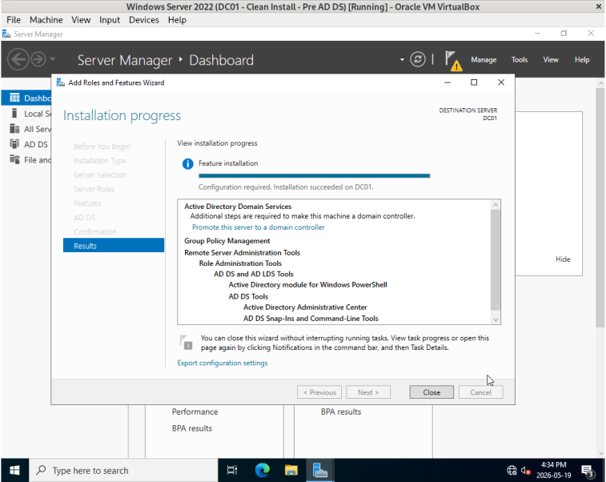
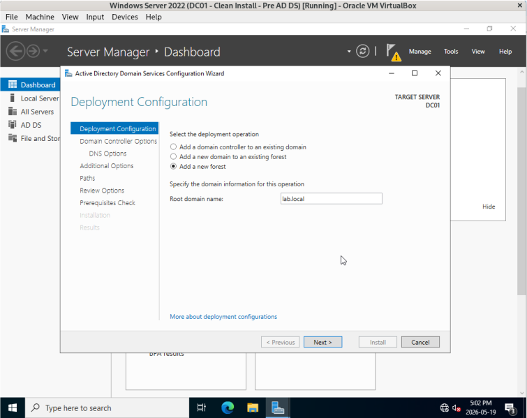
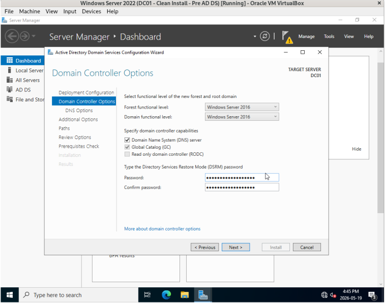
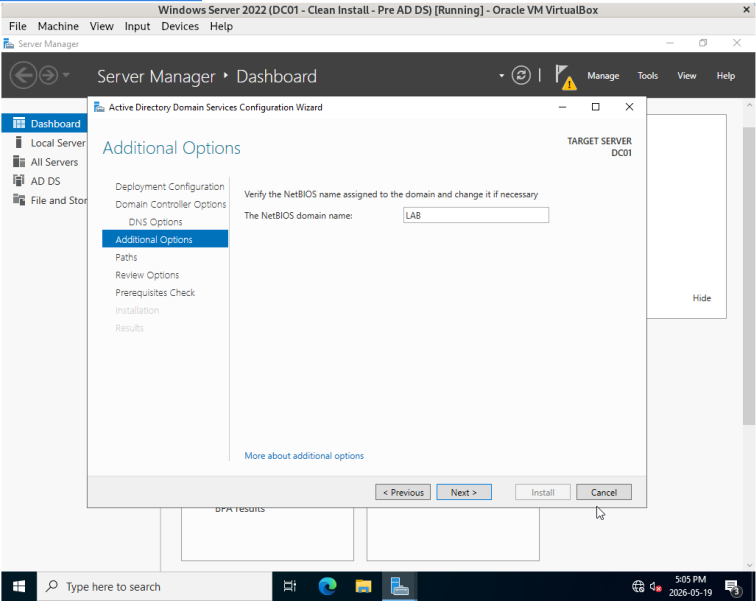
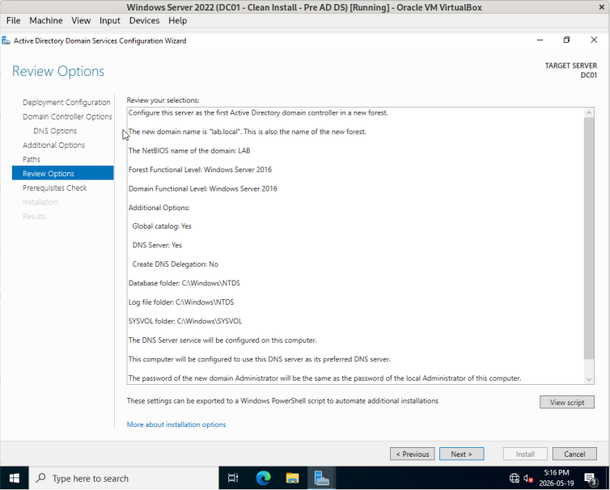
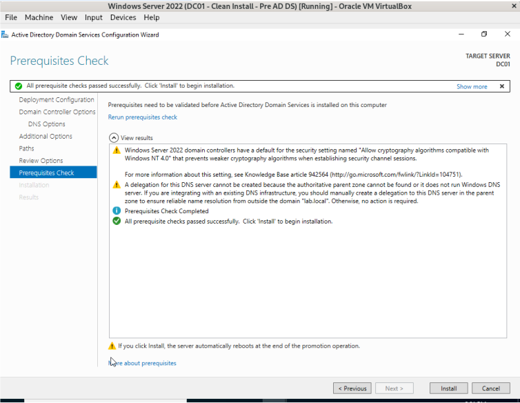
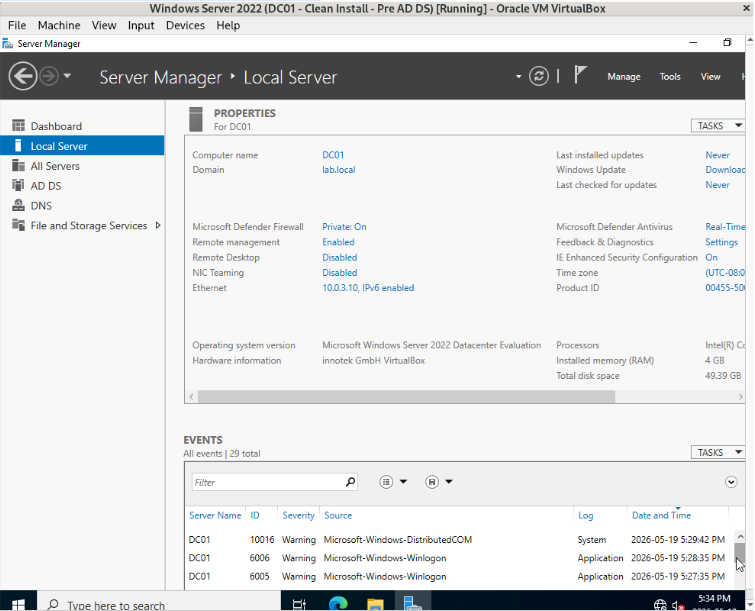

---

### 6. OU Structure and Admin Account

With DC01 promoted, I opened Active Directory Users and Computers and created two OUs directly under `lab.local`. `Admin Accounts` is for privileged administrative accounts and `IT` is for standard IT user accounts. Both OUs have accidental deletion protection enabled, which prevents them from being deleted without explicitly removing that protection first.

I created `mansour.admin` in the Admin Accounts OU and added it to the Domain Admins group. I verified the membership via PowerShell:

```powershell
Get-ADUser mansour.admin -Properties MemberOf, DistinguishedName | Select-Object name, memberof, DistinguishedName
```

The output confirmed that `mansour.admin` is a member of `CN=Domain Admins,CN=Users,DC=lab,DC=local` and lives at `CN=Mansour,OU=Admin Accounts,DC=lab,DC=local`.

The built-in Administrator account is not used for daily tasks. It exists as a break-glass account that is available if `mansour.admin` is ever locked out or the domain has a critical failure.

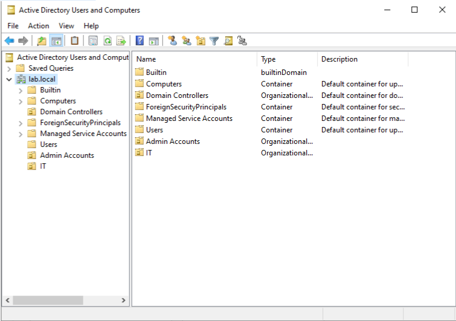
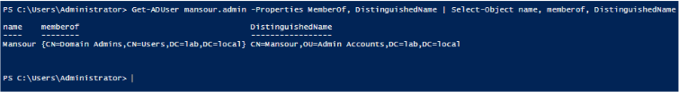

---

### 7. ICMP DROP Rule

After verifying DNS and connectivity, I added a stateful ICMP DROP rule to block DC01 from initiating pings to clients. I inserted it at position 4 in the FORWARD chain:

```bash
sudo iptables -I FORWARD 4 -i enp0s9 -o enp0s8 -p icmp --state NEW -j DROP
```

Position matters here. The rule sits before the `RELATED,ESTABLISHED` ACCEPT rule, but it uses `--state NEW` so it only drops new ICMP connections. Reply packets from client-initiated pings still pass through because they are `ESTABLISHED` traffic and hit the ACCEPT rule first. Without `--state NEW`, the DROP catches everything including legitimate return traffic and breaks client-to-DC01 connectivity entirely. Issue 4 covers what happened when I got this wrong the first time.

```bash
sudo netfilter-persistent save
```

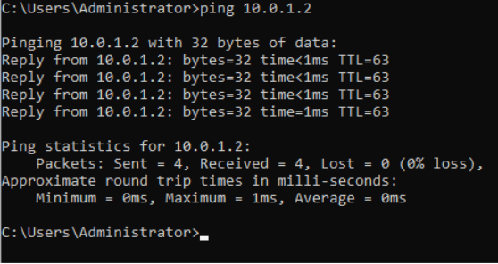
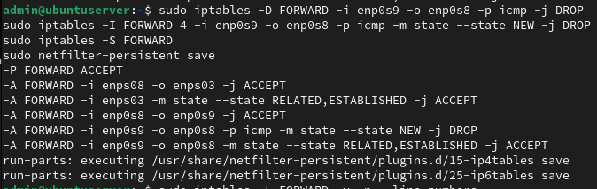
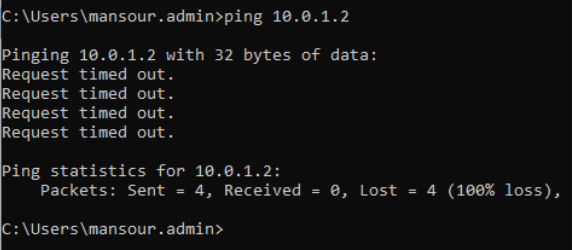
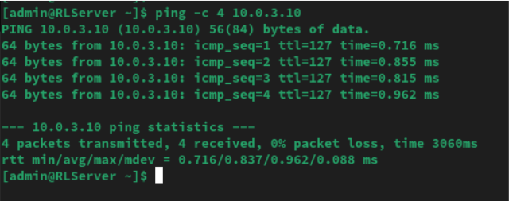

---

## Troubleshooting and Real Issues

### Issue 1: VM Booted ISO Instead of Hard Drive

**Problem:** After renaming the server to DC01 and rebooting, the Windows Server ISO installer launched instead of the OS.

**Cause:** The installation ISO was still mounted in VirtualBox's virtual optical drive. VirtualBox boot order prioritized the optical drive, so the VM booted the ISO instead of the hard drive.

**Fix:** I powered off the VM, went to Settings, then Storage, and removed the ISO from the virtual optical drive. After rebooting, the VM booted correctly from the hard drive.

VirtualBox does not automatically eject the ISO after installation completes. Always unmount it before the first post-install reboot.

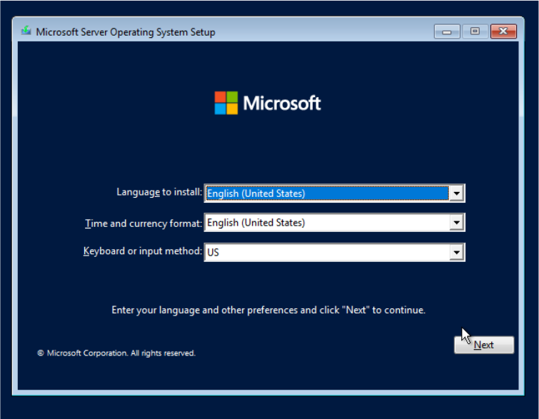
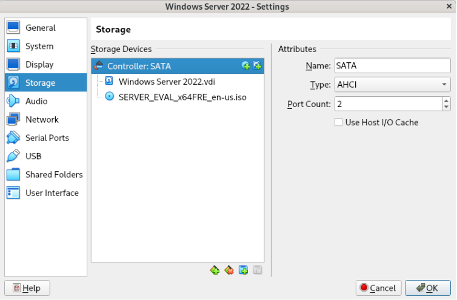
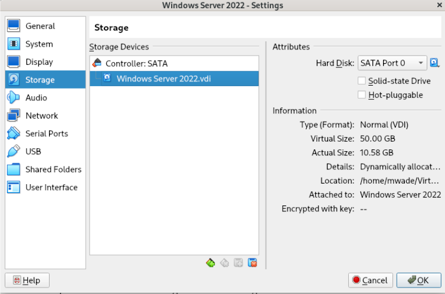
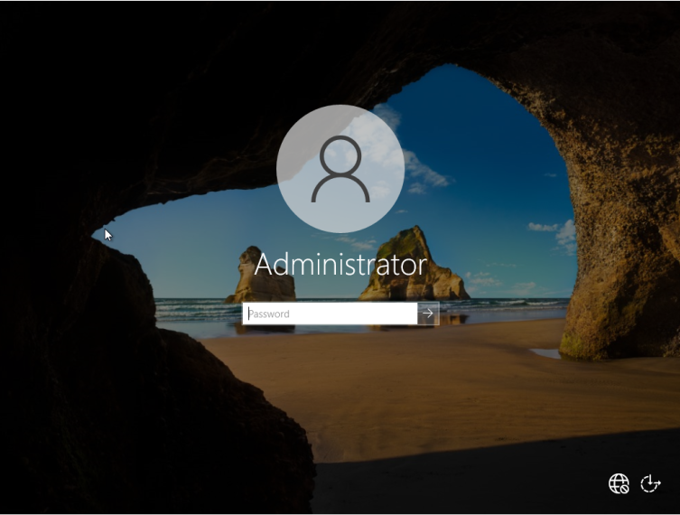

---

### Issue 2: DC01 Not Responding to ICMP

**Problem:** After deploying DC01 and confirming the gateway could reach `10.0.3.1`, Rocky Linux could not ping DC01 at `10.0.3.10`. It was 100% packet loss. DC01 could ping its own gateway but nothing beyond it.

**Cause:** Two separate issues were stacked on top of each other. Windows Defender Firewall was blocking inbound ICMP on DC01 by default because the echo request inbound rule was disabled. After fixing that, cross-subnet pings still failed because `ip_forward` had been reset to 0 on the Ubuntu gateway. The gateway was restored from a snapshot taken before `sysctl` was first applied in Project 1, so the runtime value never matched the config file.

**Fix:** On DC01 I opened Windows Defender Firewall with Advanced Security, went to Inbound Rules, and enabled "File and Printer Sharing (Echo Request - ICMPv4-In)" for all profiles. DC01 could immediately ping its gateway at `10.0.3.1`.

For the cross-subnet failure, I ran `sudo sysctl -p` on Ubuntu to force-reload `sysctl.conf`. The `ip_forward` value jumped from 0 to 1 instantly and inter-subnet routing was restored without a reboot.

After restoring any VM from a snapshot, always verify that runtime kernel settings match the config file. Running `cat /proc/sys/net/ipv4/ip_forward` and getting 0 on a gateway that is supposed to route means everything behind it is broken until you fix it manually.

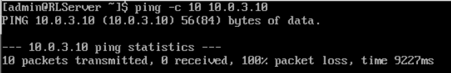

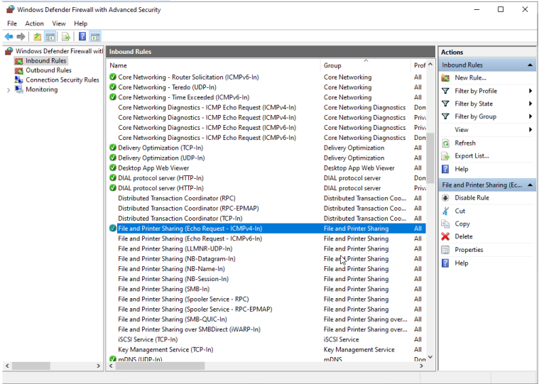
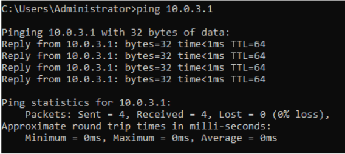
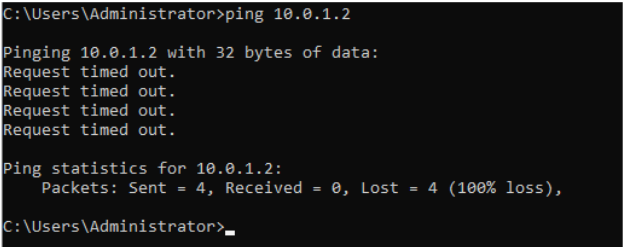
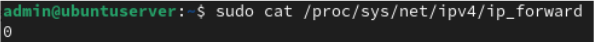
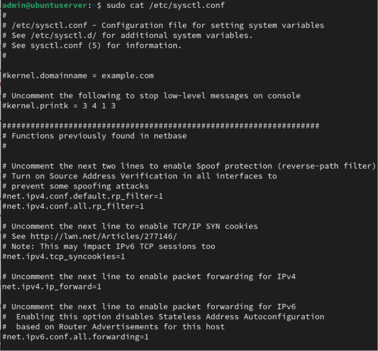
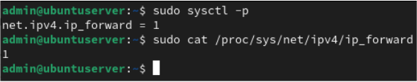
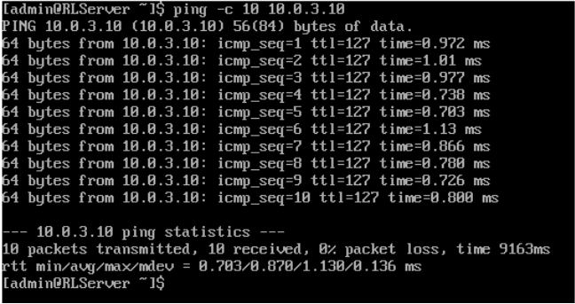
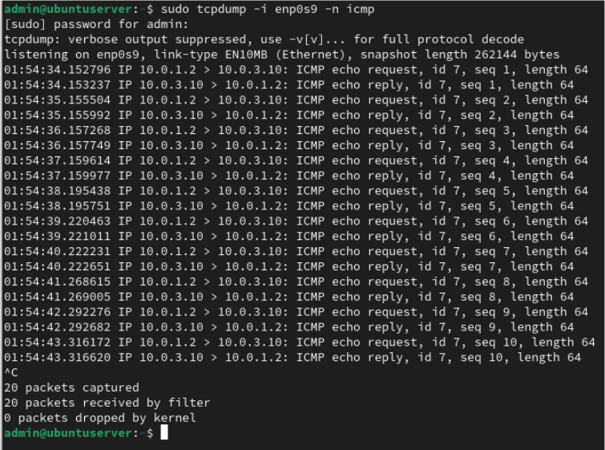

---

### Issue 3: ip_forward Not Surviving Reboot

**Problem:** Every time the Ubuntu gateway rebooted, `ip_forward` returned to 0 even though `net.ipv4.ip_forward=1` was correctly set in `/etc/sysctl.conf`. Inter-subnet routing broke on every restart.

**Cause:** During the Ubuntu boot sequence, `systemd-sysctl.service` re-evaluates interface parameters as network interfaces come online, inadvertently resetting `ip_forward` back to 0 after the initial `/etc/sysctl.conf` pass. The setting was there but it never survived the full boot sequence, and `/etc/sysctl.conf` alone is not enough for persistent kernel parameters on Ubuntu Server.

**Fix:** I created `/etc/sysctl.d/99-gateway-routing-fix.conf` with a single line:

```
net.ipv4.ip_forward=1
```

Files in `/etc/sysctl.d/` load after cloud-init and take priority over `/etc/sysctl.conf`. The `99-` prefix ensures it loads last in the directory, after anything else that might interfere.

After a full reboot, `cat /proc/sys/net/ipv4/ip_forward` returned 1 without any manual intervention. Routing was stable from that point forward.

On Ubuntu Server, always set persistent kernel parameters in `/etc/sysctl.d/` and not in `/etc/sysctl.conf`.

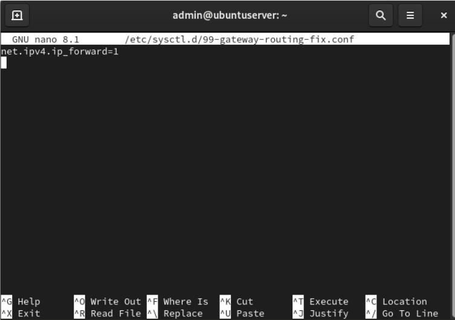


---

### Issue 4: ICMP DROP Rule Blocking Reply Packets

**Problem:** After adding the iptables ICMP DROP rule to block DC01-initiated pings, clients lost the ability to ping DC01 entirely. The rule broke traffic in both directions.

**Cause:** The initial DROP rule had no state matching, so it dropped all ICMP packets transiting from `enp0s9` to `enp0s8`, including reply packets from connections that clients had initiated. The `RELATED,ESTABLISHED` ACCEPT rule at a lower position in the chain never got reached because the DROP fired first on everything.

**Fix:** I added `--state NEW` to the DROP rule so it only catches new ICMP connections initiated from DC01's side:

```bash
sudo iptables -I FORWARD 4 -i enp0s9 -o enp0s8 -p icmp --state NEW -j DROP
```

With stateful matching, client-initiated pings to DC01 still work because the reply packets are `ESTABLISHED` traffic and hit the ACCEPT rule before the DROP. Only new connections originating from DC01 are dropped.

Always use stateful matching on DROP rules. A stateless DROP on a forwarding chain silently breaks legitimate return traffic and it is very hard to diagnose without tcpdump.


---

## Security Decisions

DC01 sits on `10.0.3.0/24`, completely separate from the client subnet `10.0.1.0/24`. Clients reach the DC through the gateway and there is no direct Layer 2 path between them. This is a deliberate architecture decision and not just a network configuration.

Clients can open connections to DC01, but DC01 cannot open new connections to clients. The `RELATED,ESTABLISHED` rule on the `enp0s9` to `enp0s8` direction only allows reply packets and not new sessions. DC01-initiated pings are blocked at the network layer with `--state NEW`, so client-to-DC01 pings still work normally.

`mansour.admin` is the account used for all domain administration tasks. The built-in Administrator account exists only as a last-resort recovery account if the primary admin account is locked out or the domain has a critical failure. Privileged accounts live in a dedicated `Admin Accounts` OU separate from the standard `IT` OU, with accidental deletion protection enabled on both.

---

## Final Verification

All tests were run after a full gateway reboot to confirm that iptables rules, ip_forward persistence, and DNS resolution all survived restart.

| Test | From | To | Notes |
| :--- | :--- | :--- | :--- |
| ping 10.0.3.1 | DC01 | Ubuntu servernet | DC01 can reach its gateway |
| ping 10.0.3.10 | Rocky | DC01 | Inter-subnet routing working |
| ping 10.0.3.10 | Fedora | DC01 | Fedora can reach DC01 directly |
| ping 10.0.3.10 | Windows 11 | DC01 | Windows client can reach DC01 |
| ping 10.0.1.2 | DC01 | Rocky | DC01-initiated ping blocked, 100% packet loss |
| nslookup lab.local | Rocky | DC01 DNS | lab.local resolves to 10.0.3.10 |
| tcpdump port 53 | Ubuntu enp0s9 | DC01 | DNS traffic hitting DC01 confirmed |
| Get-ADUser mansour.admin | DC01 PowerShell | AD | Domain Admins membership confirmed |

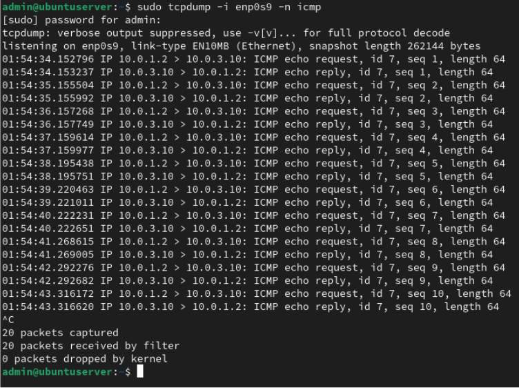
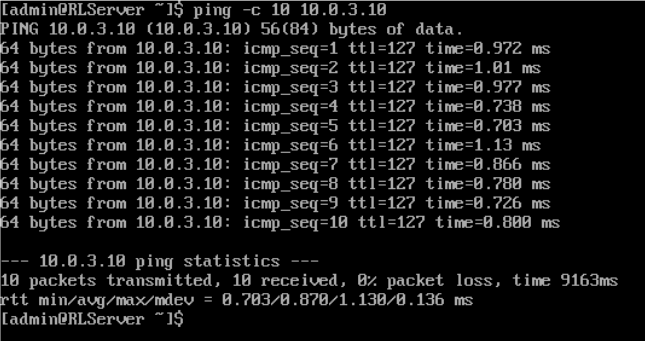
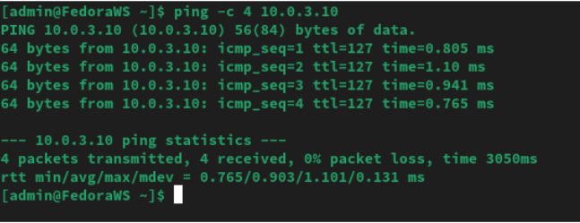
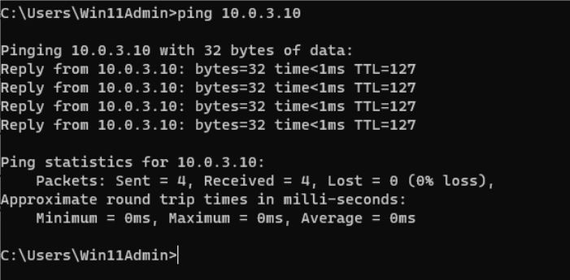

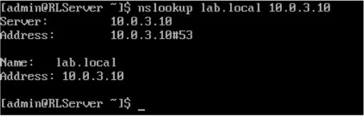
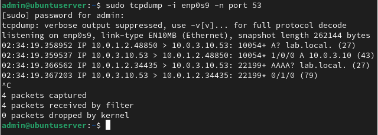


---

## What I Learned

Network segmentation is architecture and not just configuration. Putting DC01 on its own subnet was a deliberate decision about what can talk to what and who initiates the connection. That decision lives in the iptables rules and not in a checkbox.

iptables rule order is everything. A DROP rule in the wrong position breaks legitimate traffic silently and there is no error message. Packets just disappear. tcpdump is the only way to see what is actually happening at the forwarding layer.

`/etc/sysctl.conf` is not enough for persistent kernel parameters on Ubuntu Server. During boot, `systemd-sysctl.service` re-evaluates interface parameters as interfaces come online and resets runtime values before the system is fully up. That took a full reboot cycle to prove and `/etc/sysctl.d/` is the fix because it loads after the reset happens.

DNS is the foundation of Active Directory. The static IP on DC01, the DNS server pointing to itself, the decision to enable the DNS role during promotion — none of that is optional. If DNS does not work, AD does not work and nothing in the domain resolves. The order of operations during promotion matters more than it looks.

Snapshots capture runtime state and not just disk state. Restoring a snapshot that predates a `sysctl -p` call means `ip_forward` comes back as 0 even if the config file says 1. Always verify runtime values after any restore.

---

## Single Point of Failure Note

DC01 is the only domain controller and the only DNS server for `lab.local`. If it goes down, DNS resolution for the entire domain fails and no client can authenticate. In production, a second domain controller would handle DNS redundancy and ensure domain services stay available if DC01 is offline. DC02 is a planned future enhancement to this lab.
